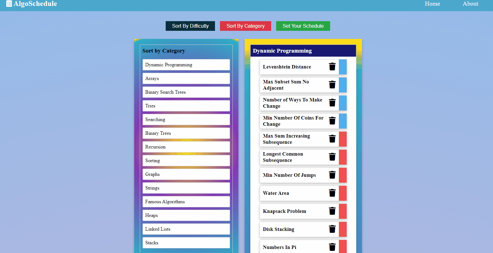

# Welcome to AlgoSchedule!

##### Live Site
https://2stash.github.io/algoschedule/

##### Purpose of Repo
The purpose of this repo is to generate a 100 day schedule for the problems at AlgoExpert. 

##### Reason to Create Repo
Honestly, any time I do anything I make some sort of schedule to track my progress and keep me motivated. I thought it would be cool to use react to make something that other people could use. I also wanted to make something that included drag and drop functionality as there are a bunch of things I want to build that use dnd.

##### Technologies
* React
* Context for state
* react-beautiful-dnd

##### Da Future
Potentially I would like to build this out in to a more general schedule builder/planner. 

